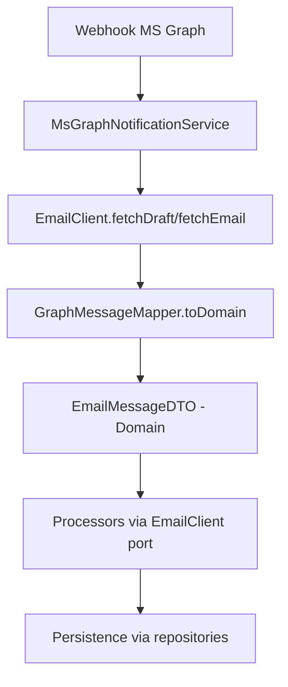

# Refactoring Architecture Emails - MsGraph

## Vue d'ensemble

Cette refactorisation implémente une architecture hexagonale propre pour la gestion des emails MsGraph, en séparant clairement les responsabilités selon les principes SOLID et DDD.

## Structure de l'architecture

### 1. Domain Layer (`app/Domain/Emails/`)

**DTO pur** (`Dto/EmailMessageDTO.php`)
- Représentation canonique côté domaine
- Types forts avec `CarbonImmutable` 
- Pas de logique, seulement transport de données
- Méthodes utilitaires pour la persistance et création d'emails

**Enums** (`Enums/`)
- `EmailImportance` : Low, Normal, High
- `EmailContentType` : HTML, Text

**Ports** (`Ports/EmailClient.php`)
- Interface `EmailClient` définissant le contrat pour les opérations email
- Découplage total de l'infrastructure MS Graph

**Services** (`Services/EmailStatusCalculator.php`)
- Logique métier centralisée pour le calcul de statut
- Réutilisable par tous les services

### 2. Support Layer (`app/Support/Email/`)

**Utilitaires stateless :**
- `HtmlToTextConverter` : Conversion HTML → texte (wrap de Soundasleep)
- `RegexCodeExtractor` : Extraction des codes regex `## code -options ##`
- `RecipientParser` : Parsing des destinataires MS Graph
- `AttachmentParser` : Parsing des pièces jointes

### 3. Infrastructure Layer (`app/Infrastructure/MsGraph/`)

**Mapper** (`Mappers/GraphMessageMapper.php`)
- Conversion GraphAPI → Domain DTO
- Toute la "cuisine" de transformation centralisée
- Utilise les utilitaires Support

**Adapter** (`GraphEmailClient.php`)  
- Implémentation du port `EmailClient`
- Adapte `MsGraphEmailService` existant
- Isolé dans la couche infrastructure

**Raw DTO** (`app/Dto/MsGraph/RawGraphMessageDTO.php`)
- Représentation exacte de la structure MS Graph
- Pas de logique, transport pur depuis l'API

## Flux de données refactorisé



## Services refactorisés

### MsGraphNotificationService
- Utilise `EmailClient` (port) au lieu de `MsGraphEmailService` direct
- Utilise `GraphMessageMapper` pour la transformation  
- Utilise `EmailStatusCalculator` pour le calcul de statut
- Ne comprend plus la structure MS Graph

### BaseEmailDraftProcessor
- Utilise `EmailClient` (port) au lieu de `MsGraphEmailService`
- Reçoit le DTO domain au lieu du DTO wire
- Plus de parsing HTML/regex (fait par le mapper)

### DraftEmailProcessor  
- Adapté pour le nouveau DTO domain
- Utilise les propriétés `bodyHtml` au lieu de `bodyOriginal`
- Création de nouveau DTO via constructeur explicite

## Bindings IoC

```php
// AppServiceProvider.php
$this->app->bind(
    \App\Domain\Emails\Ports\EmailClient::class,
    \App\Infrastructure\MsGraph\GraphEmailClient::class
);

// Singletons pour les utilitaires
$this->app->singleton(\App\Support\Email\HtmlToTextConverter::class);
$this->app->singleton(\App\Infrastructure\MsGraph\Mappers\GraphMessageMapper::class);
// etc.
```

## Avantages obtenus

✅ **Séparation claire des responsabilités**
- DTO purs sans logique externe
- Parsing centralisé dans le mapper
- Ports & adapters pour découplage

✅ **Testabilité améliorée**  
- Processors testables via mock du port EmailClient
- Utilitaires indépendants et stateless
- Mapper isolé et unitairement testable

✅ **Évolutivité**
- Infrastructure remplaçable (Graph → IMAP) sans impact processors
- Ajout de nouveaux champs en une passe mapper
- Enums extensibles

✅ **Lisibilité et maintenabilité**
- Chaque classe a une responsabilité unique
- Flux de données linéaire et prévisible
- Documentation par le code (types, interfaces)

## Migration et compatibilité

L'ancien `EmailMessageDTO` a été sauvegardé en `.old`. 

**Cas d'usage à adapter manuellement :**
- Fichiers utilisant l'ancien DTO (voir `grep "App\Dto\MsGraph\EmailMessageDTO"`)
- Propriétés spécifiques à l'ancien format (`toRecipientsMails`, `bodyOriginal`, etc.)
- Tests utilisant l'ancienne structure

## Tests

Un script de test vérifie le bon fonctionnement : `test_new_architecture.php`

```bash
php test_new_architecture.php
# ✓ DTO créé avec succès
# ✓ HtmlToTextConverter fonctionne  
# ✓ RegexCodeExtractor fonctionne
# 🎉 Tous les tests passent !
```