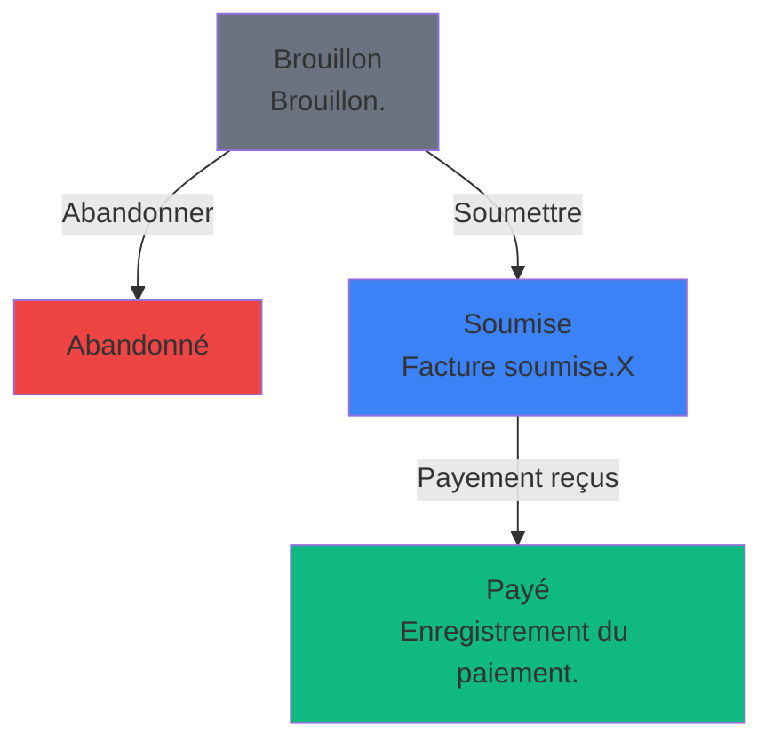

# Trait HasMermaidStateDiagram

Le trait `HasMermaidStateDiagram` permet à n'importe quel modèle Laravel utilisant Spatie's Model States d'afficher automatiquement ses états et transitions sous format Mermaid.

## Installation et Configuration

### 1. Ajouter le trait à votre modèle

```php
<?php

namespace App\Models;

use App\Traits\HasMermaidStateDiagram;
use Spatie\ModelStates\HasStates;
use Illuminate\Database\Eloquent\Model;

class Invoice extends Model
{
    use HasMermaidStateDiagram, HasStates;
    
    protected $casts = [
        'state' => InvoiceState::class,
    ];
}
```

### 2. Utilisation de base

```php
$invoice = Invoice::first();

// Récupérer les données Mermaid au format JSON
$data = $invoice->getMermaidData();

// Générer la syntaxe Mermaid
$syntax = $invoice->toMermaidSyntax();

// Afficher l'état courant seulement
$current = $invoice->getCurrentStateMermaid();
```

## Méthodes disponibles

### `getMermaidData(array $options = []): array`

Retourne les données complètes du diagramme au format JSON compatible avec notre composant MermaidDiagramEntry.

```php
$data = $invoice->getMermaidData([
    'type' => 'flowchart',      // Type de diagramme
    'direction' => 'TB'         // Direction: LR, RL, TB, BT
]);
```

**Structure retournée :**
```json
{
    "type": "flowchart",
    "direction": "LR",
    "nodes": [
        {
            "id": "draft",
            "label": "Brouillon",
            "description": "Brouillon.",
            "color": "#6B7280",
            "icon": "heroicon-o-pencil",
            "class": "App\\Models\\States\\Invoice\\Draft",
            "type": "state"
        }
    ],
    "edges": [
        {
            "from": "draft",
            "to": "submited",
            "label": "Soumettre",
            "description": null,
            "class": "App\\Models\\States\\Invoice\\ToSubmited",
            "style": "normal",
            "type": "transition"
        }
    ],
    "metadata": {
        "model": "App\\Models\\Invoice",
        "total_states": 4,
        "total_transitions": 3,
        "generated_at": "2025-10-24T08:27:45.813397Z",
        "diagram_type": "state_machine"
    }
}
```

### `toMermaidSyntax(array $options = []): string`

Génère la syntaxe Mermaid complète prête à être utilisée.

```php
$syntax = $invoice->toMermaidSyntax([
    'type' => 'flowchart',
    'direction' => 'TB'
]);
```

**Résultat :**


### `getCurrentStateMermaid(): string`

Affiche seulement l'état courant du modèle.

```php
$current = $invoice->getCurrentStateMermaid();
```

### `toSimpleMermaid(): string`

Raccourci pour générer un diagramme simple horizontal.

```php
$simple = $invoice->toSimpleMermaid();
```

## Options disponibles

| Option | Description | Valeurs possibles | Défaut |
|--------|-------------|------------------|--------|
| `type` | Type de diagramme Mermaid | `flowchart`, `graph`, `stateDiagram-v2` | `flowchart` |
| `direction` | Direction du diagramme | `LR`, `RL`, `TB`, `BT` | `LR` |
| `state_field` | Champ contenant l'état | Nom du champ | `state` |

## Intégration avec Filament

### Dans un Resource

```php
use App\Filament\Infolists\Components\MermaidDiagramEntry;

public static function infolist(Infolist $infolist): Infolist
{
    return $infolist
        ->schema([
            MermaidDiagramEntry::make('state_diagram')
                ->label('États et Transitions')
                ->apiEndpoint(function ($record) {
                    return route('api.states.mermaid-json-from-trait', [
                        'model' => 'Invoice',
                        'id' => $record->id ?? 'new'
                    ]);
                })
                ->type('flowchart')
                ->direction('TB')
                ->height('500px'),
        ]);
}
```

### Dans une Page Filament

```php
use App\Filament\Infolists\Components\MermaidDiagramEntry;

public function mermaidInfolist(Infolist $infolist): Infolist
{
    return $infolist
        ->record($this->record)
        ->schema([
            MermaidDiagramEntry::make('states')
                ->apiEndpoint(route('api.states.mermaid-json-from-trait', [
                    'model' => 'Invoice',
                    'id' => $this->record->id
                ]))
                ->height('400px'),
        ]);
}
```

## API Endpoints

Le trait est compatible avec l'endpoint API suivant :

```
GET /api/states/{model}/{id}/mermaid-json-from-trait
```

**Paramètres :**
- `model` : Nom du modèle (ex: Invoice)
- `id` : ID de l'enregistrement ou "new" pour un diagramme générique
- `type` (query) : Type de diagramme (optionnel)
- `direction` (query) : Direction du diagramme (optionnel)

**Exemple :**
```
GET /api/states/Invoice/123/mermaid-json-from-trait?type=flowchart&direction=TB
```

## Cache

Le trait utilise automatiquement le cache Laravel pour optimiser les performances :

- **Durée de cache :** 1 heure
- **Clé de cache :** Basée sur la classe du modèle et les options
- **Invalidation :** Automatique après 1 heure

Pour forcer le rafraîchissement :

```php
$cacheKey = 'mermaid_data_' . Invoice::class . '_' . md5(serialize($options));
Cache::forget($cacheKey);
$freshData = $invoice->getMermaidData();
```

## Fonctionnalités

### ✅ Découverte automatique des états
- Scanne automatiquement tous les états depuis la classe de base
- Récupère les labels, descriptions, couleurs et icônes Filament
- Support des états avec `HasLabel`, `HasDescription`, `HasColor`, `HasIcon`

### ✅ Gestion des transitions
- Analyse automatique des transitions autorisées
- Support des transitions avec labels et descriptions
- Styles de transitions (normal, thick, dotted)

### ✅ Compatibilité Filament
- Mapping automatique des couleurs Filament vers hexadécimal
- Support des icônes Heroicons
- Intégration native avec MermaidDiagramEntry

### ✅ Performance
- Cache intelligent de 1 heure
- Génération optimisée des données
- Réutilisation des instances

## Comparaison avec l'API FilamentStateFusion

| Fonctionnalité | Trait HasMermaidStateDiagram | API FilamentStateFusion |
|----------------|----------------------------|------------------------|
| **Performance** | ⚡ Plus rapide (cache intégré) | Requête HTTP |
| **Facilité d'usage** | ✅ Directement sur le modèle | Via endpoints API |
| **Métadonnées** | ✅ Essentielles | 🔥 Très complètes |
| **Cache** | ✅ Automatique | Manuel |
| **Flexibilité** | ✅ Options personnalisables | 🔥 Très flexible |
| **Usage** | Modèles individuels | Analyse globale |

## Dépannage

### Erreur "No state configuration found"
```php
// Vérifiez que votre modèle utilise HasStates et a un cast state
protected $casts = [
    'state' => YourStateClass::class,
];
```

### États non découverts
```php
// Vérifiez que vos classes d'états implémentent les bonnes interfaces
class Draft extends YourBaseState implements HasLabel, HasColor, HasIcon
{
    // ...
}
```

### Cache non mis à jour
```php
// Videz manuellement le cache
Cache::forget('mermaid_data_' . YourModel::class . '_*');
```

## Exemples complets

Voir le fichier `app/Examples/MermaidTraitExamples.php` pour des exemples d'utilisation détaillés.

## Commandes utiles

```bash
# Tester le trait avec un modèle
php artisan demo:mermaid-trait

# Voir les routes API disponibles
php artisan route:list --path=api/states
```