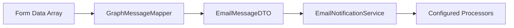

# Suppression de MsgConnect - Migration Finale

## Problème Identifié

La classe `MsgConnect` et sa facade étaient encore référencées dans le code mais n'existaient plus physiquement, créant des dépendances cassées.

## Références Obsolètes Trouvées

### ❌ AppServiceProvider - Singleton Obsolète
```php
$this->app->singleton('msgconnect', function () {
    return new MsgConnect; // Classe n'existait plus !
});
```

### ❌ Job ProcessEmailNotification
```php
use App\Facades\MsgConnect;

public function handle()
{
    MsgConnect::processEmailNotification($this->notificationData);
}
```

### ❌ Pages Filament Ressources MsGraph
```php
use App\Facades\MsGraph\MsgConnect;

MsgConnect::launchTestServices($msgUser, $dataEmail);
```

## Solutions Appliquées

### ✅ AppServiceProvider - Nettoyage Complet
**Supprimé** :
- Import `use App\Services\MsGraph\MsgConnect;`
- Binding singleton `'msgconnect'`

**Résultat** : Service provider propre, plus de références obsolètes.

### ✅ ProcessEmailNotification Job
**Avant** :
```php
use App\Facades\MsgConnect;

public function handle()
{
    MsgConnect::processEmailNotification($this->notificationData);
}
```

**Après** :
```php
use CharlesStOlive\MsGraphFilament\Services\Email\EmailNotificationService;

public function handle(EmailNotificationService $notificationService)
{
    $notificationService->processEmailNotification($this->notificationData);
}
```

**Bénéfices** :
- ✅ Injection de dépendance Laravel correcte
- ✅ Service du package utilisé
- ✅ Plus de dépendance vers facade inexistante

### ✅ Pages Filament MsgDraftUserResource & MsgInUserResource
**Avant** :
```php
use App\Facades\MsGraph\MsgConnect;

MsgConnect::launchTestServices($msgUser, $dataEmail);
```

**Après** :
```php
use CharlesStOlive\MsGraphFilament\Services\Email\EmailNotificationService;
use CharlesStOlive\MsGraphFilament\Services\Email\Dto\EmailMessageDTO;
use CharlesStOlive\MsGraphFilament\Infrastructure\MsGraph\Mappers\GraphMessageMapper;

// Créer un DTO depuis les données du formulaire
$mapper = app(GraphMessageMapper::class);
$emailDTO = $mapper->toDomain($dataEmail);

// Lancer les services configurés
$notificationService = app(EmailNotificationService::class);
$notificationService->launchSubscribedServices($msgUser, $emailDTO);       // Pour EmailIn
$notificationService->launchSubscribedDraftServices($msgUser, $emailDTO); // Pour Draft
```

**Améliorations** :
- ✅ **Mapping correct** : Données formulaire → EmailMessageDTO
- ✅ **Services appropriés** : `launchSubscribedServices` vs `launchSubscribedDraftServices`
- ✅ **Architecture propre** : Plus de facade, injection via container
- ✅ **Type safety** : EmailMessageDTO typé au lieu de array

## Mapping des Fonctionnalités

| Ancienne Méthode | Nouvelle Méthode | Service |
|-----------------|------------------|---------|
| `MsgConnect::processEmailNotification()` | `EmailNotificationService::processEmailNotification()` | EmailNotificationService |
| `MsgConnect::launchTestServices()` (Draft) | `EmailNotificationService::launchSubscribedDraftServices()` | EmailNotificationService |
| `MsgConnect::launchTestServices()` (EmailIn) | `EmailNotificationService::launchSubscribedServices()` | EmailNotificationService |

## Architecture Finale

### ✅ Dependency Injection Correcte
```php
// Job avec injection automatique
public function handle(EmailNotificationService $notificationService) { ... }

// Pages Filament avec résolution de container
$notificationService = app(EmailNotificationService::class);
$mapper = app(GraphMessageMapper::class);
```

### ✅ Data Flow Amélioré


### ✅ Services du Package Utilisés
- `EmailNotificationService` : Gestion des notifications et lancement des processeurs
- `GraphMessageMapper` : Transformation données → DTO
- `EmailMessageDTO` : Structure de données typée

## Validation

### ✅ Aucune Référence Obsolète
```bash
grep -r "MsgConnect" .          # Aucun résultat
grep -r "msgconnect" .          # Aucun résultat
grep -r "App\Facades\MsgConnect" .  # Aucun résultat
```

### ✅ Aucune Erreur de Compilation
- AppServiceProvider ✅
- ProcessEmailNotification Job ✅  
- Pages Filament ressources ✅

### ✅ Fonctionnalité Préservée
- Traitement des notifications email ✅
- Test des services depuis l'interface ✅
- Architecture découplée du package ✅

## Impact Technique

### 🎯 Migration Complète
- **Plus de facades obsolètes** : Architecture orientée services
- **Injection propre** : Laravel DI container utilisé correctement
- **Type safety** : EmailMessageDTO au lieu d'arrays
- **Package autonome** : Toute la logique centralisée

### 🎯 Maintenabilité
- **Code découplé** : Job et pages n'ont plus de dépendances hard-coded
- **Services testables** : Injection permet le mocking facile
- **Architecture cohérente** : Même pattern partout (service → DTO → processeurs)

## Status: ✅ MIGRATION 100% COMPLETE

Toutes les références obsolètes à `MsgConnect` ont été supprimées et remplacées par les services appropriés du package. L'architecture est maintenant complètement cohérente et utilise exclusivement les services du package msgraph-filament.