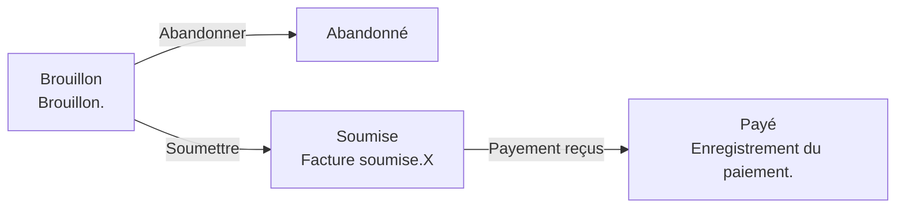

# États et Transitions - Invoice

> Documentation générée automatiquement le 2025-10-24T09:26:07.075923Z

## 📊 États disponibles

### Abandonné

| Propriété | Valeur |
|-----------|--------|
| 📛 Nom | `Canceled` |
| 🏷️ Label | Abandonné |
| 🎨 Couleur | #EF4444 |
| 🎯 Icône | `heroicon-o-x-mark` |
| 📦 Classe | `App\Models\States\Invoice\Canceled` |

### Brouillon

Brouillon.

| Propriété | Valeur |
|-----------|--------|
| 📛 Nom | `Draft` |
| 🏷️ Label | Brouillon |
| 🎨 Couleur | #6B7280 |
| 🎯 Icône | `heroicon-o-pencil` |
| 📦 Classe | `App\Models\States\Invoice\Draft` |

### Payé

Enregistrement du paiement.

| Propriété | Valeur |
|-----------|--------|
| 📛 Nom | `Payed` |
| 🏷️ Label | Payé |
| 🎨 Couleur | #10B981 |
| 🎯 Icône | `heroicon-o-check` |
| 📦 Classe | `App\Models\States\Invoice\Payed` |

### Soumise

Facture soumise.X

| Propriété | Valeur |
|-----------|--------|
| 📛 Nom | `Submited` |
| 🏷️ Label | Soumise |
| 🎨 Couleur | #3B82F6 |
| 🎯 Icône | `heroicon-o-paper-airplane` |
| 📦 Classe | `App\Models\States\Invoice\Submited` |

## 🔄 Transitions disponibles

### Soumettre

**Draft** → **Submited**

| Propriété | Valeur |
|-----------|--------|
| 📛 Nom | `ToSubmited` |
| 🏷️ Label | Soumettre |
| ⬅️ État source | Draft (`draft`) |
| ➡️ État cible | Submited (`submited`) |
| 📦 Classe | `App\Models\States\Invoice\ToSubmited` |

### Payement reçus

**Submited** → **Payed**

| Propriété | Valeur |
|-----------|--------|
| 📛 Nom | `ToPayed` |
| 🏷️ Label | Payement reçus |
| ⬅️ État source | Submited (`submited`) |
| ➡️ État cible | Payed (`payed`) |
| 📦 Classe | `App\Models\States\Invoice\ToPayed` |

### Abandonner

**Draft** → **Canceled**

| Propriété | Valeur |
|-----------|--------|
| 📛 Nom | `ToCanceled` |
| 🏷️ Label | Abandonner |
| ⬅️ État source | Draft (`draft`) |
| ➡️ État cible | Canceled (`canceled`) |
| 📦 Classe | `App\Models\States\Invoice\ToCanceled` |

## 📈 Diagramme Mermaid

## ℹ️ Métadonnées

| Propriété | Valeur |
|-----------|--------|
| Model | `App\Models\Invoice` |
| Model name | `Invoice` |
| Parser | `StateParserService` |
| Version | `1.0.0` |
| Generated at | `2025-10-24T09:26:07.075923Z` |

---

*Documentation générée par StateAnalysisService*
